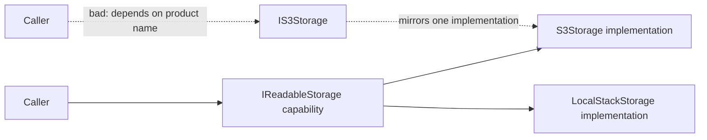
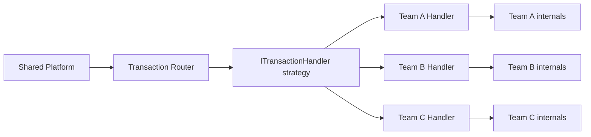
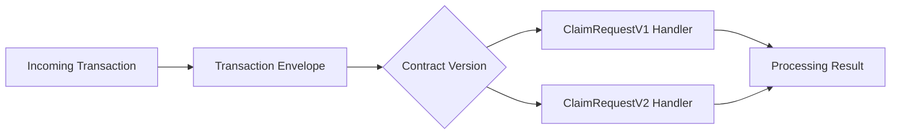
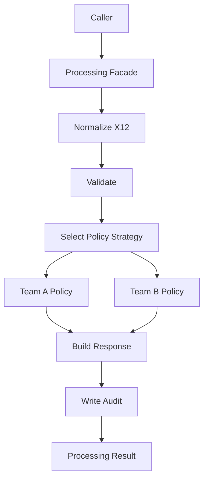
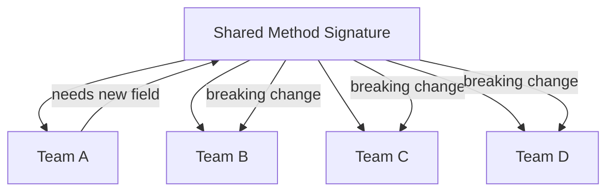

# Contract Evolution in Shared C# Systems

This guide is for C# teams sharing one codebase while handling different
variations of the same transaction domain.

The central problem is not code reuse. It is keeping contracts stable while many
teams evolve independently.

When 10 teams become 20 teams, shared method signatures become a coordination
bottleneck. A change for Team A should not force Team B to spend three sprints
upgrading unrelated code.

## The Shape

| Need | Pattern / Practice |
| --- | --- |
| Stable entry points | Interface contracts |
| Keep old implementations working | Adapter |
| Hide workflow complexity | Facade |
| Isolate team-specific business behavior | Strategy / Policy |
| Evolve request and response shapes safely | Versioned contracts |

The rest of this guide keeps each idea together: short note, diagram, then code
shape.

## 1. Interfaces Define Behavior

Interfaces should name the behavior a caller needs, not the concrete class,
vendor, environment, or implementation detail behind it.

The story in this diagram is split in two:

- The solid path is the good shape: the caller depends on a capability,
  `IReadableStorage`. Either `S3Storage` or `LocalStackStorage` can provide that
  behavior.
- The dotted path is the bad shape: the caller depends on `IS3Storage`, which is
  just the implementation name turned into an interface. That locks the caller to
  a product concept instead of a behavior.



The goal is not to create an interface for every class. The goal is to name the
capability that multiple implementations can satisfy.

The `ClassName` / `IClassName` habit often came from a reasonable place: teams
needed seams for tests and mocks. That can be a useful first step away from hard
dependencies. But it should not be the final design rule. A better testing seam
is usually a capability interface at the consumer boundary, such as
`IReadableStorage` or `IWritableStorage`, because it describes what the caller
actually needs.

Worst scenario: implementation-named interfaces.

```csharp
public sealed class LocalStackStorage
{
    public Task PutAsync(string key, Stream content, CancellationToken cancellationToken);
}

public interface ILocalStackStorage
{
    Task PutAsync(string key, Stream content, CancellationToken cancellationToken);
}

public sealed class S3Storage
{
    public Task PutAsync(string key, Stream content, CancellationToken cancellationToken);
}

public interface IS3Storage
{
    Task PutAsync(string key, Stream content, CancellationToken cancellationToken);
}
```

The interfaces above just copy implementation names. Callers now depend on the
storage product instead of the capability they need.

Better: a broader category interface.

```csharp
public interface ICloudStorage
{
    Task PutAsync(string key, Stream content, CancellationToken cancellationToken);
    Task<Stream> GetAsync(string key, CancellationToken cancellationToken);
}
```

`ICloudStorage` is better than `IS3Storage` because it does not name the vendor
or emulator. But it is still a category, not a precise behavior. It can become
too broad if some callers only read, some only write, and some need delete,
listing, retention, replication, or lifecycle behavior.

Best when possible: capability interfaces.

```csharp
public interface IReadableStorage
{
    Task<Stream> GetAsync(string key, CancellationToken cancellationToken);
}

public interface IWritableStorage
{
    Task PutAsync(string key, Stream content, CancellationToken cancellationToken);
}

public sealed class S3Storage : IReadableStorage, IWritableStorage
{
    public Task<Stream> GetAsync(string key, CancellationToken cancellationToken)
    {
        // AWS S3-backed read implementation.
        throw new NotImplementedException();
    }

    public Task PutAsync(string key, Stream content, CancellationToken cancellationToken)
    {
        // AWS S3-backed write implementation.
        throw new NotImplementedException();
    }
}
```

Use a broader category interface only when callers genuinely need the whole
category contract.

## 2. Strategy: One Plug Shape, Many Team Behaviors

This is the pattern teams are most likely to use here.

Strategy means the shared platform calls one stable behavior, while each team
supplies its own implementation of that behavior.

The point is simple: give every team implementation the same plug shape.

Bad shape: the shared method keeps growing as teams add special cases.

```csharp
public sealed class TransactionProcessor
{
    public ProcessingResult Process(
        TransactionEnvelope transaction,
        ProcessingContext context,
        string? teamASpecialCode,
        bool teamBOverride,
        string? teamCProgramType)
    {
        // Every new team need changes this shared signature.
        throw new NotImplementedException();
    }
}
```

That shape makes Team B react to Team A's change even when Team B does not care
about Team A's new field.

Better shape: make the team-specific behavior a strategy.

```csharp
public interface ITransactionHandler
{
    ProcessingResult Handle(
        TransactionEnvelope transaction,
        ProcessingContext context);
}
```

Each team implements the same strategy interface:

```csharp
public sealed class TeamAHandler : ITransactionHandler
{
    public ProcessingResult Handle(
        TransactionEnvelope transaction,
        ProcessingContext context)
    {
        // Team A-specific behavior stays behind the contract.
        throw new NotImplementedException();
    }
}

public sealed class TeamBHandler : ITransactionHandler
{
    public ProcessingResult Handle(
        TransactionEnvelope transaction,
        ProcessingContext context)
    {
        // Team B does not change just because Team A changes internally.
        throw new NotImplementedException();
    }
}
```

A router selects the strategy:

```csharp
public sealed class TransactionRouter
{
    private readonly IReadOnlyDictionary<string, ITransactionHandler> _handlers;

    public TransactionRouter(IReadOnlyDictionary<string, ITransactionHandler> handlers)
    {
        _handlers = handlers;
    }

    public ProcessingResult Process(
        TransactionEnvelope transaction,
        ProcessingContext context)
    {
        var handler = _handlers[transaction.OwningTeam];
        return handler.Handle(transaction, context);
    }
}
```



The story is:

- `ITransactionHandler` is the shared strategy interface
- each team handler is an interchangeable strategy implementation
- the router chooses which strategy to use
- each team owns its implementation behind that plug
- team-specific variation should not automatically become a new shared method parameter

Facade is a separate pattern. A facade may sit in front of this flow to hide the
larger workflow from callers, but the pattern doing the team-specific variation
here is Strategy.

Production code may add async, cancellation, or generics when those solve a real
problem. The core idea is simpler: callers depend on one stable behavior.

Good candidates for stable strategy contracts include:

- transaction handlers
- eligibility policies
- validation policies
- routing policies
- payer-specific rules
- group-specific rules
- response builders

## 3. Versioned Contracts: Do Not Mutate the Ground Under Everyone

Strategy keeps team behavior behind a stable plug. Versioned contracts solve a
different problem: the shape of the data itself changes over time.

The failure mode is changing a shared request in place and making every team
update at once.

Bad shape: one request type keeps changing.

```csharp
public sealed record ClaimRequest(
    string MemberId,
    string PayerId,
    string RawX12,
    string PopulationCode); // Added for Team A, now everyone must deal with it.
```

That may look harmless, but it creates questions for every existing team:

- Is `PopulationCode` required?
- What value should old callers send?
- Can old handlers ignore it?
- Does validation now fail for teams that do not use it?
- Did this change alter the meaning of an existing request?

Better shape: make the contract change explicit.

```csharp
public sealed record ClaimRequestV1(
    string MemberId,
    string PayerId,
    string RawX12);

public sealed record ClaimRequestV2(
    string MemberId,
    string PayerId,
    string PopulationCode,
    string RawX12);
```

Now the system can support both shapes during the migration.



The version tells the platform which contract the payload follows. Old callers
can keep sending `V1` while teams that need the new field move to `V2`.

There is no reflection or dynamic invocation required. The platform can route
versions with ordinary code: inspect the envelope, parse the payload into the
matching request type, then call the matching handler.

```csharp
public sealed class ClaimDispatcher
{
    private readonly ClaimV1Handler _v1Handler;
    private readonly ClaimV2Handler _v2Handler;

    public ClaimDispatcher(
        ClaimV1Handler v1Handler,
        ClaimV2Handler v2Handler)
    {
        _v1Handler = v1Handler;
        _v2Handler = v2Handler;
    }

    public ProcessingResult Dispatch(TransactionEnvelope envelope)
    {
        return envelope.ContractVersion switch
        {
            "1" => _v1Handler.Handle(
                JsonSerializer.Deserialize<ClaimRequestV1>(envelope.Payload)!),

            "2" => _v2Handler.Handle(
                JsonSerializer.Deserialize<ClaimRequestV2>(envelope.Payload)!),

            _ => throw new NotSupportedException(
                $"Unsupported claim contract version: {envelope.ContractVersion}")
        };
    }
}
```

A registry or DI container can replace the `switch` when the list gets large,
but the idea is the same: explicit version dispatch, not runtime guessing.

An envelope keeps routing, ownership, version, and audit data stable even when
the payload evolves.

```csharp
public sealed record TransactionEnvelope(
    string TransactionType,
    string ContractVersion,
    string OwningTeam,
    IReadOnlyDictionary<string, string> Metadata,
    BinaryData Payload);
```

The envelope is not where every business field goes. It is the stable wrapper
around a versioned payload.

For example:

```csharp
public sealed record ProcessingResult(
    string Status,
    IReadOnlyList<string> Messages);
```

The useful rule is:

- additive optional fields may fit in the current version
- new required fields usually mean a new version
- changed meaning of an existing field means a new version
- removing or renaming fields means a new version
- old versions need an owner, support window, and retirement plan

Versioning is not free. It adds mapping and support cost. But that cost is often
smaller than forcing 20 teams to upgrade in lockstep.

The important boundary is this:

- version dispatch chooses the correct version-specific path
- an adapter translates between versions when the selected implementation cannot
  speak the requested version yet

That is where section 4 starts.

## 4. Adapter During Contract Change

Version dispatch answers, "Which contract version did we receive?"

Adapter answers, "How do we let an older implementation participate without
forcing it to upgrade today?"

Adapters let a team keep an old implementation while the shared contract moves
forward.


An adapter is a boundary tool. It should have an owner and a removal plan.

```csharp
public sealed class LegacyTeamBHandlerAdapter
    : ITransactionHandler<ClaimRequestV2, ClaimResultV2>
{
    private readonly TeamBLegacyProcessor _legacy;

    public LegacyTeamBHandlerAdapter(TeamBLegacyProcessor legacy)
    {
        _legacy = legacy;
    }

    public async Task<ClaimResultV2> HandleAsync(
        ClaimRequestV2 request,
        ProcessingContext context,
        CancellationToken cancellationToken)
    {
        var oldRequest = TeamBMapper.ToV1(request);
        var oldResult = await _legacy.ProcessAsync(oldRequest, cancellationToken);
        return TeamBMapper.ToV2(oldResult);
    }
}
```

Use adapters to bridge old and new contracts. Do not let adapters become
permanent dumping grounds.

The same idea in Python-style pseudocode:

```python
class TeamBAdapter:
    def __init__(self, legacy_team_b_processor):
        self.legacy = legacy_team_b_processor

    def handle_v2(self, claim_v2):
        # Team B still only understands the V1 shape.
        claim_v1 = {
            "member_id": claim_v2["member_id"],
            "payer_id": claim_v2["payer_id"],
            "raw_x12": claim_v2["raw_x12"],
        }

        old_result = self.legacy.handle_v1(claim_v1)

        # The platform expects the newer result shape.
        return {
            "status": old_result["status"],
            "messages": old_result.get("messages", []),
            "handled_by_adapter": True,
        }
```

The adapter is doing two translations:

- incoming `ClaimRequestV2` to the legacy `ClaimRequestV1` shape
- legacy result back to the shape the newer platform expects

## 5. Facade plus Strategy: One Front Door, Swappable Rules

Facade and Strategy solve different problems, but they often appear together.

- Facade gives callers one simple front door.
- Strategy lets the workflow swap team, payer, group, or program-specific rules.

Without a facade, callers learn too much about the workflow:

```csharp
var normalized = normalizer.Normalize(envelope);
var validation = validator.Validate(normalized);
var route = router.Route(validation);
var policy = policySelector.Select(route);
var decision = policy.Evaluate(route.Member, envelope);
var result = responseBuilder.Build(decision);
auditor.Write(result);
```

That is too much workflow knowledge leaking into callers.

With a facade, callers do one thing:

```csharp
var result = processor.Process(envelope);
```

The facade hides the workflow:

```csharp
public sealed class TransactionProcessingFacade
{
    private readonly X12Normalizer _normalizer;
    private readonly TransactionValidator _validator;
    private readonly PolicySelector _policySelector;
    private readonly ResponseBuilder _responseBuilder;
    private readonly AuditWriter _auditWriter;

    public ProcessingResult Process(TransactionEnvelope envelope)
    {
        var transaction = _normalizer.Normalize(envelope);
        var validation = _validator.Validate(transaction);
        var policy = _policySelector.Select(transaction);
        var decision = policy.Evaluate(transaction.Member, envelope);
        var result = _responseBuilder.Build(validation, decision);

        _auditWriter.Write(result);
        return result;
    }
}
```

The strategy is the policy selected inside the workflow:

```csharp
public interface IEligibilityPolicy
{
    EligibilityDecision Evaluate(
        MemberContext member,
        TransactionEnvelope transaction);
}

public sealed class TeamAEligibilityPolicy : IEligibilityPolicy
{
    public EligibilityDecision Evaluate(
        MemberContext member,
        TransactionEnvelope transaction)
    {
        // Team A rules live here.
        return EligibilityDecision.Approved();
    }
}

public sealed class TeamBEligibilityPolicy : IEligibilityPolicy
{
    public EligibilityDecision Evaluate(
        MemberContext member,
        TransactionEnvelope transaction)
    {
        // Team B rules live here.
        return EligibilityDecision.Denied("Missing required enrollment data.");
    }
}
```

The selector chooses the strategy:

```csharp
public sealed class PolicySelector
{
    private readonly TeamAEligibilityPolicy _teamA;
    private readonly TeamBEligibilityPolicy _teamB;

    public IEligibilityPolicy Select(NormalizedTransaction transaction)
    {
        return transaction.OwningTeam switch
        {
            "TeamA" => _teamA,
            "TeamB" => _teamB,
            _ => throw new NotSupportedException("No policy for team.")
        };
    }
}
```



The story is:

- callers should not orchestrate the workflow themselves
- the facade owns the workflow order
- strategy owns the business variation inside the workflow
- adding Team C should usually add a new policy, not a new facade method

## 6. Bad Shape: Signature Churn

This is the failure mode to avoid.



If every team must react to every team-specific change, the contract is too
volatile or too low-level.

## Team Rules

### Contract Rules

- Interfaces define behavior or capability, not implementation names.
- Do not create one interface per class just to mirror that class.
- Prefer capability names like `IReadableStorage`, `IWritableStorage`, or
  `IEligibilityPolicy`.
- Category names like `ICloudStorage` are acceptable only when callers genuinely
  need the whole category contract.
- Avoid implementation names like `IS3Storage`, `ILocalStackStorage`, or
  `ITeamAProcessor`.
- Shared method signatures are stable by default.
- Additive contract changes are preferred.
- Removing, renaming, or adding required fields requires a new contract version.
- Versioned contracts need an owner and a deprecation timeline.
- Every breaking change must include a migration path.

### Adapter Rules

- An adapter has a named owner.
- An adapter exists at a boundary, not in the middle of business logic.
- An adapter should translate between contracts, not accumulate new policy rules.
- Temporary adapters should have retirement criteria.

### Facade Rules

- Callers use the facade instead of reaching into workflow internals.
- The facade owns orchestration, not every business rule.
- Internal workflow changes should not force caller changes.

### Strategy / Policy Rules

- Team-specific behavior belongs behind a strategy, policy, handler, or module.
- New team variation should not automatically become a new shared parameter.
- Strategies should be testable without running the whole transaction platform.
- Shared contracts define the entry point; teams own their implementation behind it.

## Review Checklist

Before approving a shared contract change, ask these questions and act on the
answer.

| Question | If so, then... |
| --- | --- |
| Does this interface just mirror one class? | Rename or reshape it around the behavior the caller needs. Do not create `ClassName` / `IClassName` pairs by default. |
| Is this interface a broad category with methods some callers do not use? | Split it into smaller capability interfaces such as `IReadableStorage` and `IWritableStorage`. |
| Is this change specific to one team? | Put it behind that team's strategy, policy, handler, or adapter instead of changing the shared contract. |
| Is this a new business rule variation? | Add or replace a strategy/policy implementation. Do not add a new shared parameter unless every implementation truly needs it. |
| Is this an additive optional field? | It may fit in the current contract version, but document the default behavior for teams that ignore it. |
| Is this a new required field? | Create a new contract version and define a migration path. |
| Does this rename, remove, or change the meaning of a field? | Create a new contract version. Treat it as breaking even if the compiler does not. |
| Does an older implementation need to keep working? | Add an adapter at the boundary and name its owner. |
| Is an adapter being introduced? | Define what it translates, who owns it, and when it can be removed. |
| Are callers learning internal workflow steps? | Move the orchestration behind a facade. |
| Is the facade accumulating team-specific rules? | Move those rules into strategies or policies behind the facade. |
| Would this force unrelated teams to change code? | Stop and redesign the boundary before approving the change. |

The review goal is not to block change, but to keep one team's change
from becoming every team's emergency.
