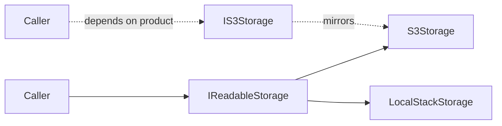
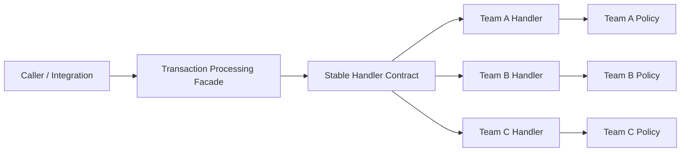
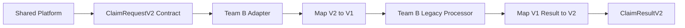
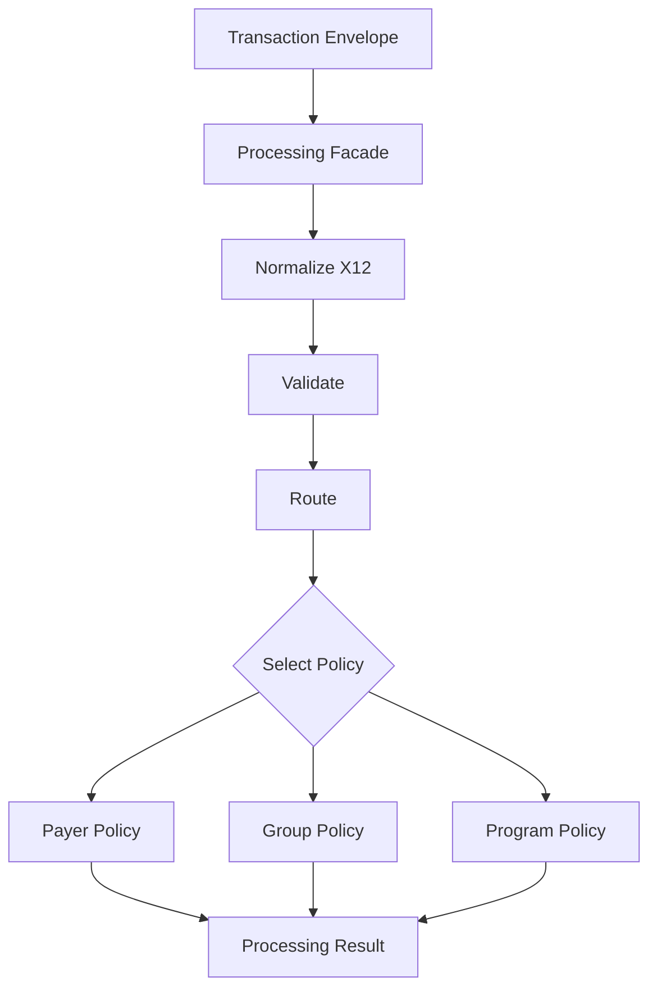
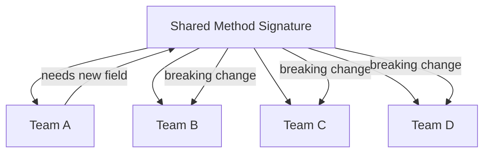

# Contract Evolution in Shared C# Systems

This guide is for C# teams sharing one codebase while handling different
variations of the same transaction domain.

The central problem is not code reuse. It is keeping contracts stable while many
teams evolve independently.

When 10 teams become 20 teams, shared method signatures become a coordination
bottleneck. A change for Team A should not force Team B to spend three sprints
upgrading unrelated code.

## The Shape

| Need | Pattern / Practice |
| --- | --- |
| Stable entry points | Interface contracts |
| Keep old implementations working | Adapter |
| Hide workflow complexity | Facade |
| Isolate team-specific business behavior | Strategy / Policy |
| Evolve request and response shapes safely | Versioned contracts |

The rest of this guide keeps each idea together: short note, diagram, then code
shape.

## 1. Interfaces Define Behavior

Interfaces should name the behavior a caller needs, not the concrete class,
vendor, environment, or implementation detail behind it.



Worst: implementation-named interfaces.

```csharp
public sealed class LocalStackStorage
{
    public Task PutAsync(string key, Stream content, CancellationToken cancellationToken);
}

public interface ILocalStackStorage
{
    Task PutAsync(string key, Stream content, CancellationToken cancellationToken);
}

public sealed class S3Storage
{
    public Task PutAsync(string key, Stream content, CancellationToken cancellationToken);
}

public interface IS3Storage
{
    Task PutAsync(string key, Stream content, CancellationToken cancellationToken);
}
```

The interfaces above just copy implementation names. Callers now depend on the
storage product instead of the capability they need.

Better: a broader category interface.

```csharp
public interface ICloudStorage
{
    Task PutAsync(string key, Stream content, CancellationToken cancellationToken);
    Task<Stream> GetAsync(string key, CancellationToken cancellationToken);
}
```

`ICloudStorage` is better than `IS3Storage` because it does not name the vendor
or emulator. But it is still a category, not a precise behavior. It can become
too broad if some callers only read, some only write, and some need delete,
listing, retention, replication, or lifecycle behavior.

Best when possible: capability interfaces.

```csharp
public interface IReadableStorage
{
    Task<Stream> GetAsync(string key, CancellationToken cancellationToken);
}

public interface IWritableStorage
{
    Task PutAsync(string key, Stream content, CancellationToken cancellationToken);
}

public sealed class S3Storage : IReadableStorage, IWritableStorage
{
    public Task<Stream> GetAsync(string key, CancellationToken cancellationToken)
    {
        // AWS S3-backed read implementation.
        throw new NotImplementedException();
    }

    public Task PutAsync(string key, Stream content, CancellationToken cancellationToken)
    {
        // AWS S3-backed write implementation.
        throw new NotImplementedException();
    }
}
```

Use a broader category interface only when callers genuinely need the whole
category contract.

## 2. Stable Boundary

The shared system should expose stable contracts. Team-specific behavior sits
behind those contracts.



The caller depends on the facade and stable handler contract, not on each team's
internal implementation details.

```csharp
public interface ITransactionHandler<TRequest, TResponse>
{
    Task<TResponse> HandleAsync(
        TRequest request,
        ProcessingContext context,
        CancellationToken cancellationToken);
}
```

Good candidates for stable contracts include:

- transaction envelopes
- normalized X12 transaction models
- validation results
- routing decisions
- processing results
- audit or event outputs
- team-owned handlers or policies

## 3. Versioned Contracts

Adding a required field to a shared request is a breaking change. Versioned
contracts make that break explicit.

```csharp
public sealed record ClaimRequestV1(
    string MemberId,
    string PayerId,
    string RawX12);

public sealed record ClaimRequestV2(
    string MemberId,
    string PayerId,
    string PopulationCode,
    string RawX12);

public sealed record ClaimResultV2(
    string Status,
    IReadOnlyList<string> Messages);
```

An envelope gives the platform stable routing and audit data while allowing the
payload contract to evolve deliberately.

```csharp
public sealed record TransactionEnvelope(
    string TransactionType,
    string ContractVersion,
    string OwningTeam,
    IReadOnlyDictionary<string, string> Metadata,
    BinaryData Payload);
```

## 4. Adapter During Contract Change

Adapters let a team keep an old implementation while the shared contract moves
forward.



An adapter is a boundary tool. It should have an owner and a removal plan.

```csharp
public sealed class LegacyTeamBHandlerAdapter
    : ITransactionHandler<ClaimRequestV2, ClaimResultV2>
{
    private readonly TeamBLegacyProcessor _legacy;

    public LegacyTeamBHandlerAdapter(TeamBLegacyProcessor legacy)
    {
        _legacy = legacy;
    }

    public async Task<ClaimResultV2> HandleAsync(
        ClaimRequestV2 request,
        ProcessingContext context,
        CancellationToken cancellationToken)
    {
        var oldRequest = TeamBMapper.ToV1(request);
        var oldResult = await _legacy.ProcessAsync(oldRequest, cancellationToken);
        return TeamBMapper.ToV2(oldResult);
    }
}
```

Use adapters to bridge old and new contracts. Do not let adapters become
permanent dumping grounds.

## 5. Facade plus Strategy

The facade owns the workflow. Strategies own the business variation.



The facade keeps callers away from parsing, normalization, validation, routing,
policy execution, response generation, and auditing.

```csharp
public interface ITransactionProcessingFacade
{
    Task<ProcessingResult> ProcessAsync(
        TransactionEnvelope envelope,
        CancellationToken cancellationToken);
}
```

Strategies or policies isolate behavior that varies by team, payer, group,
population, or program.

```csharp
public interface IEligibilityPolicy
{
    EligibilityDecision Evaluate(
        MemberContext member,
        TransactionEnvelope transaction);
}

public sealed class TeamAEligibilityPolicy : IEligibilityPolicy
{
    public EligibilityDecision Evaluate(
        MemberContext member,
        TransactionEnvelope transaction)
    {
        // Team A rules live here.
        return EligibilityDecision.Approved();
    }
}
```

## 6. Bad Shape: Signature Churn

This is the failure mode to avoid.



If every team must react to every team-specific change, the contract is too
volatile or too low-level.

## Team Rules

### Contract Rules

- Interfaces define behavior or capability, not implementation names.
- Do not create one interface per class just to mirror that class.
- Prefer capability names like `IReadableStorage`, `IWritableStorage`, or
  `IEligibilityPolicy`.
- Category names like `ICloudStorage` are acceptable only when callers genuinely
  need the whole category contract.
- Avoid implementation names like `IS3Storage`, `ILocalStackStorage`, or
  `ITeamAProcessor`.
- Shared method signatures are stable by default.
- Additive contract changes are preferred.
- Removing, renaming, or adding required fields requires a new contract version.
- Versioned contracts need an owner and a deprecation timeline.
- Every breaking change must include a migration path.

### Adapter Rules

- An adapter has a named owner.
- An adapter exists at a boundary, not in the middle of business logic.
- An adapter should translate between contracts, not accumulate new policy rules.
- Temporary adapters should have retirement criteria.

### Facade Rules

- Callers use the facade instead of reaching into workflow internals.
- The facade owns orchestration, not every business rule.
- Internal workflow changes should not force caller changes.

### Strategy / Policy Rules

- Team-specific behavior belongs behind a strategy, policy, handler, or module.
- New team variation should not automatically become a new shared parameter.
- Strategies should be testable without running the whole transaction platform.
- Shared contracts define the entry point; teams own their implementation behind it.

## Review Checklist

Before approving a shared contract change, ask:

- Does this interface describe behavior, or does it just mirror one class?
- Is this interface a precise capability, or a broad category that will force
  callers to depend on methods they do not use?
- Is this change specific to one team or truly shared?
- Can this be represented as a new strategy or policy instead of a new parameter?
- Is this additive, or does it break existing implementations?
- Does an older implementation need an adapter?
- Who owns the migration and retirement plan?
- Can the facade absorb this change without exposing more internals?
