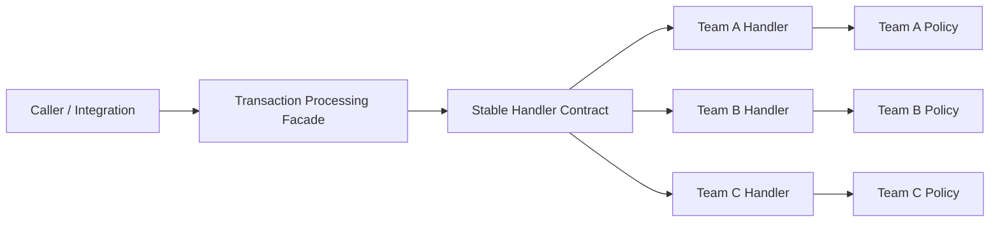
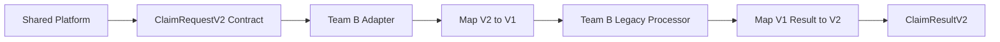
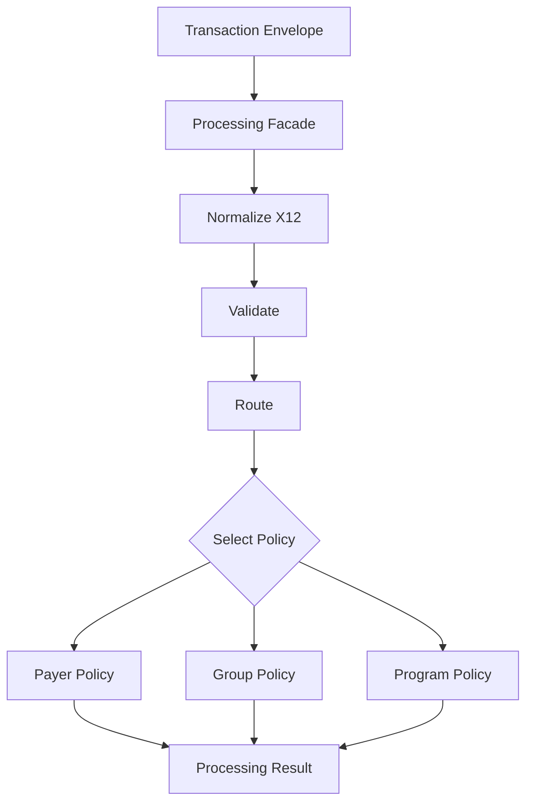
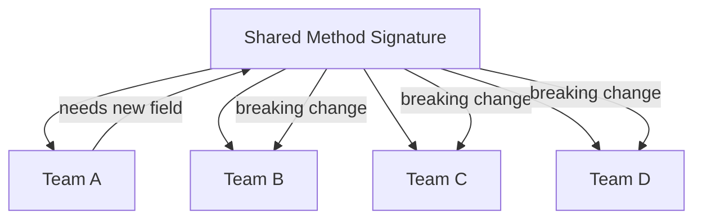

# Contract Evolution Diagrams

These diagrams are intentionally small. They are meant for whiteboards, PR
discussions, and team onboarding.

## 1. Stable Boundary

The shared system should expose stable contracts. Team-specific behavior sits
behind those contracts.

Key point: callers depend on the facade and stable contract, not on each team's
internal implementation details.

## 2. Adapter During Contract Change

Adapters let a team keep an old implementation while the shared contract moves
forward.

Key point: an adapter is a boundary tool. It should have an owner and a removal
plan.

## 3. Facade plus Strategy

The facade owns the workflow. Strategies own the business variation.

Key point: new business variation should usually add or replace a policy, not
change every shared method signature.

## 4. Bad Shape: Signature Churn

This is the failure mode to avoid.

Key point: if every team must react to every team-specific change, the contract
is too volatile or too low-level.
